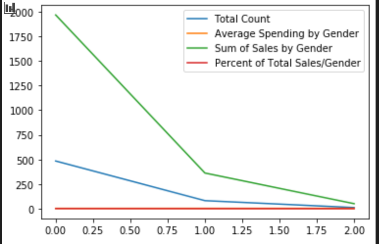
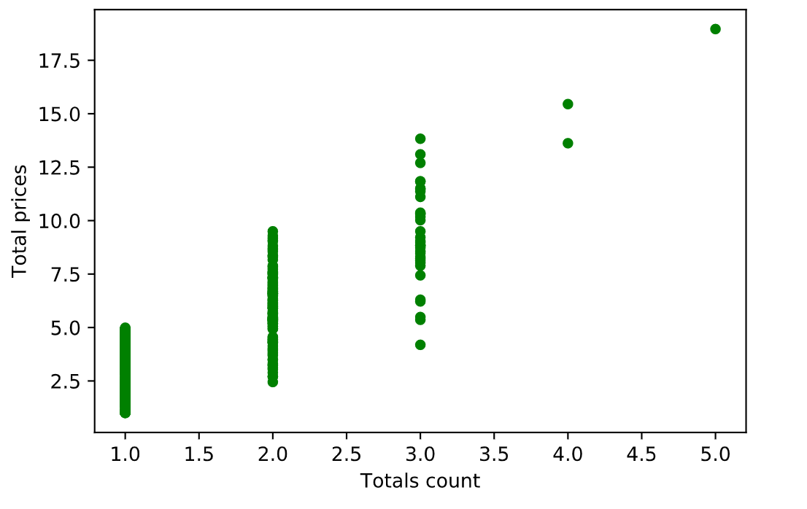

# Game_Sales_Analysis
## Video game sales set analyzed

### About
Data set includes gender, game, pricepoint and sales volume.  

As might be expected, males accounted for the vast majority of sales, however women spend a bit more individually. Here is a very simple site with a few visualizations from the analysis.
 <a href='https://sherirosalia.github.io/Game_Sales_Analysis/'>Link</a>

### Frameworks and Dependencies
Python Pandas
Jupyter Notebook

### File Structure
Python script in HeroesofPymoli Jupyter Notebook
Screenshots in root folder
CSV file holds data and can be found in "Resources" folder.

### Visualizations

#### Gender comparison

#### Top gamers are bigger spenders

#### Best sellers
